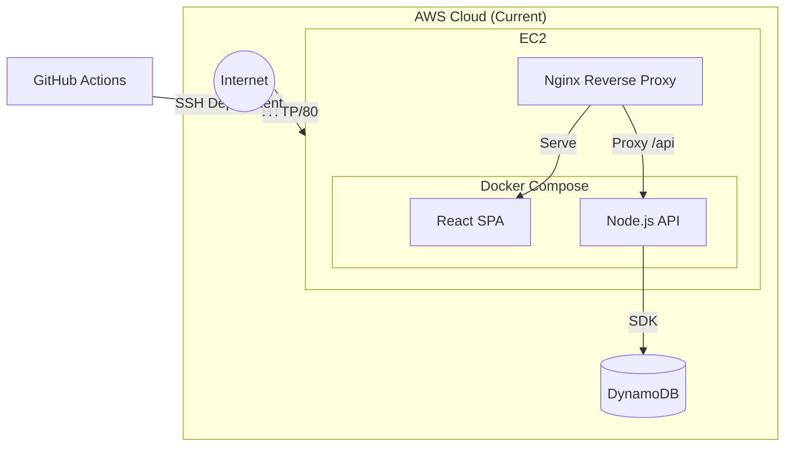

# Project Architecture (AWS)

## 1. Current Architecture (MVP)

Currently, the application is a monolithic Docker Compose deployment on a single EC2 instance.



## 2. Proposed Architecture (AI-Native)

This architecture integrates the required AI components (Pinecone, OpenRouter), performance layers (Redis), and leverages **AWS Fargate (ECS)** for serverless container scaling.


```mermaid

graph TD

    subgraph "External Services"

        OpenRouter[OpenRouter API (LLM)]

        Pinecone[(Pinecone Vector DB)]

        Stripe[Stripe Billing]

    end


    subgraph "AWS Cloud (Target)"

        Internet((Internet)) -->|HTTPS| CF[CloudFront CDN]

        Internet -->|HTTPS| ALB[Application Load Balancer]

        

        subgraph "Frontend Layer"

            S3[S3 Bucket (Static Assets)]

            CF --> S3

        end

        

        subgraph "ECS Cluster"

            Fargate[Fargate Service (Auto-Scaling)]

            Fargate --> Task1[Task Container 1]

            Fargate --> Task2[Task Container 2]

            ALB --> Fargate

        end

        

        subgraph "Data Layer"

            DDB[(DynamoDB - User/Job Data)]

            Redis[(Redis - Semantic Cache)]

        end

        

        Task1 & Task2 -->|Read/Write| DDB

        Task1 & Task2 -->|Cache Hit/Miss| Redis

        Task1 & Task2 -->|Vector Search| Pinecone

        Task1 & Task2 -->|Inference| OpenRouter

        

        Stripe -->|Webhook| ALB

    end
****
```
