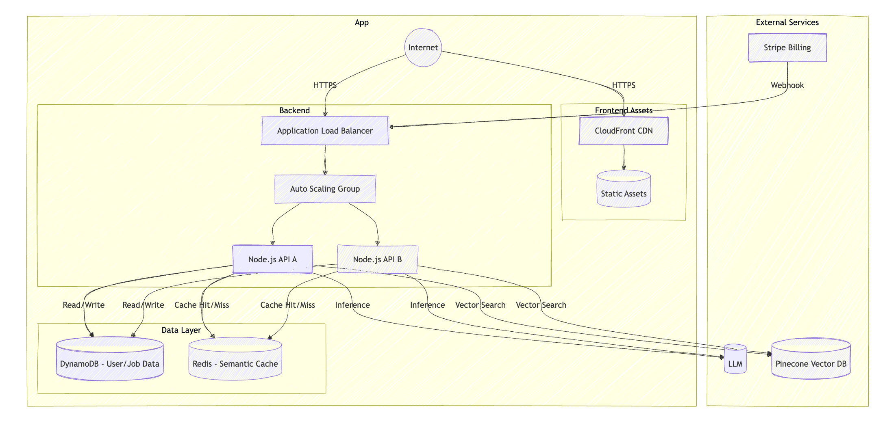

## apply flow tracker

ApplyFlow empowers job seekers to enter a state of flow in their application process.  
Track applications, manage progress, and land your dream job – all in one beautiful, intuitive interface.

---

## Features
- **Smart Job Tracking**: Intuitive dashboard to manage all your applications  
- **Real-time Updates**: Optimistic UI updates for a snappy experience  
- **Progress Tracking**: Visual kanban board for application stages  
- **Secure by Design**: JWT authentication with httpOnly cookies  
- **Modern UI**: Built with React + Tailwind for a beautiful experience  

---
## Architechture diagram

---
## Tech

| Layer     | Technology                       |
|-----------|----------------------------------|
| Frontend  | React                            |
| Backend   | Node                             |
| Data      | DynamoDB + S3                    |
| Auth      | Passport.js                      |

---

## Getting started

---

## Coming Soon
- Bi-weekly Sprint Review generator  
- Smart "Take Action" button  
- Analytics dashboard  

